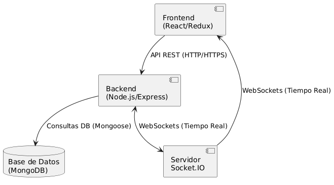
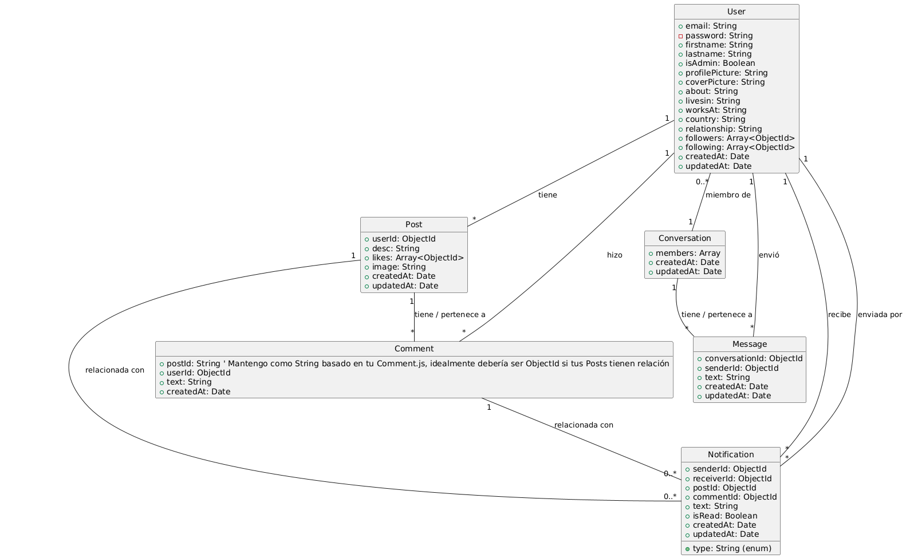
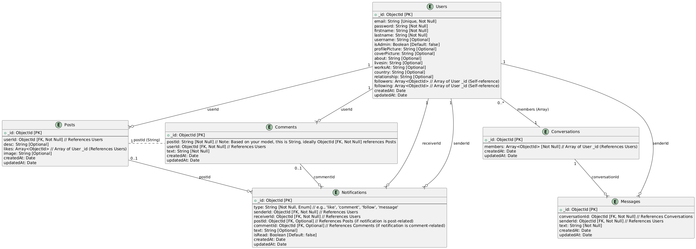

# Aplicación Web de Red Social (Stack MERN)

## Descripción del Proyecto y Funcionalidades

Este proyecto es una aplicación web de red social construida utilizando el stack MERN (MongoDB, Express.js, React, Node.js). Proporciona a los usuarios una plataforma para conectar, compartir pensamientos e imágenes, interactuar con contenido y comunicarse mediante mensajes directos.

### Funcionalidades Clave

- **Autenticación de Usuarios** con JWT
- **Perfiles de Usuario** con edición de perfil e imágenes
- **Sistema de Seguidores**
- **Gestión de Publicaciones** (crear, editar, eliminar)
- **Likes y Comentarios**
- **Chat en Tiempo Real** con Socket.IO
- **Notificaciones** de interacción
- **Búsqueda** de usuarios y posts
- **Panel de Administración** (usuarios y publicaciones)

---

## Arquitectura del Sistema

El frontend está construido en React con Redux y React Router. El backend está desarrollado en Node.js con Express y utiliza Socket.IO para funcionalidades en tiempo real. La base de datos es MongoDB y se gestiona mediante Mongoose.

### Diagrama de Arquitectura



---

## Diagramas de Estructura

### Diagrama UML (Modelos del Backend)



### Diagrama ER (Base de Datos)



---

## Endpoints del Backend

> Todos los endpoints están bajo `/api/` y requieren autenticación JWT salvo indicación contraria.

### Autenticación (`/auth`)
- `POST /auth/register` – Registro de usuario
- `POST /auth/login` – Login de usuario

### Usuarios (`/user`)
- Buscar: `GET /user/search?q=...`
- Perfil: `GET /user/:id`
- Editar: `PUT /user/:id`
- Eliminar: `DELETE /user/:id`
- Seguir: `PUT /user/:id/follow`
- Dejar de seguir: `PUT /user/:id/unfollow`

### Publicaciones (`/post`)
- Crear: `POST /post`
- Ver: `GET /post/:id`
- Editar: `PUT /post/:id`
- Eliminar: `DELETE /post/:id`
- Like/Dislike: `PUT /post/:id/like_dislike`
- Timeline: `GET /post/:id/timeline`
- Todos los posts: `GET /post/all`

### Comentarios (`/comment`)
- Añadir: `POST /comment/:postId`
- Ver: `GET /comment/:postId`

### Subida de Archivos (`/upload`)
- `POST /upload` – Subir imagen

### Conversaciones (`/conversation`)
- Crear/Buscar: `POST /conversation`
- Listar: `GET /conversation/:userId`

### Mensajes (`/message`)
- Enviar: `POST /message`
- Ver: `GET /message/:chatId`

### Notificaciones (`/notification`)
- Ver: `GET /notification/`
- Marcar como leídas: `PUT /notification/read`

### Administración (`/admin`)
- Listar usuarios: `GET /admin/users`
- Eliminar usuario: `DELETE /admin/users/:id`
- Listar posts: `GET /admin/posts`
- Eliminar post: `DELETE /admin/posts/:id`

---

## Modelos de Datos (Mongoose)

### User
```js
{
  email, password, firstname, lastname, username,
  isAdmin, profilePicture, coverPicture, about,
  livesin, worksAt, country, relationship,
  followers: [], following: []
}
```

### Post
```js
{
  userId, desc, image, likes: []
}
```

### Comment
```js
{
  postId, userId, text
}
```

### Conversation
```js
{
  members: []
}
```

### Message
```js
{
  conversationId, senderId, text
}
```

### Notification
```js
{
  type, senderId, receiverId, postId?, commentId?, text, isRead
}
```

---

## Ejecución Local

### Requisitos Previos

- Node.js y npm
- MongoDB (local o Atlas)
- Git

### Instrucciones

#### 1. Clonar el Repositorio
```bash
git clone https://github.com/gabrielleon31/MP12-PROJ4-GK.git
cd MP12-PROJ4-GK
```

#### 2. Backend

```bash
cd Server
npm install
```

Crea `.env` con:
```
MONGO_DB=<tu cadena MongoDB>
JWT_SECRET=<tu clave secreta>
PORT=5000
CLIENT_URL=http://localhost:3000
BACKEND_PUBLIC_FOLDER=http://localhost:5000/images/
```

Inicia el servidor:
```bash
npm start
```

#### 3. Frontend

```bash
cd client
npm install
```

Crea `.env` con:
```
REACT_APP_API_URL=http://localhost:5000/api
REACT_APP_BACKEND_PUBLIC_FOLDER=http://localhost:5000/images/
```

Inicia el cliente:
```bash
npm start
```

---

## Despliegue

- **Frontend (Vercel)**:  
  https://social-media-mern-frontend.vercel.app/

- **Backend (Render)**:  
  https://social-media-backend-api-kxbf.onrender.com

- **Base de Datos**: MongoDB Atlas

---

## .gitignore
Ya está configurado para ignorar:
- `.env`
- `node_modules/`
- `build/`
- `*.log`

---

## Licencia

Este proyecto está licenciado bajo la **Licencia MIT**.

---

## Funcionalidades Opcionales Implementadas

- Chat en Tiempo Real con Socket.IO
- Panel de Notificaciones
- Panel de Administración (usuarios/posts)
- Buscador de usuarios y publicaciones
- Despliegue en la nube completo
